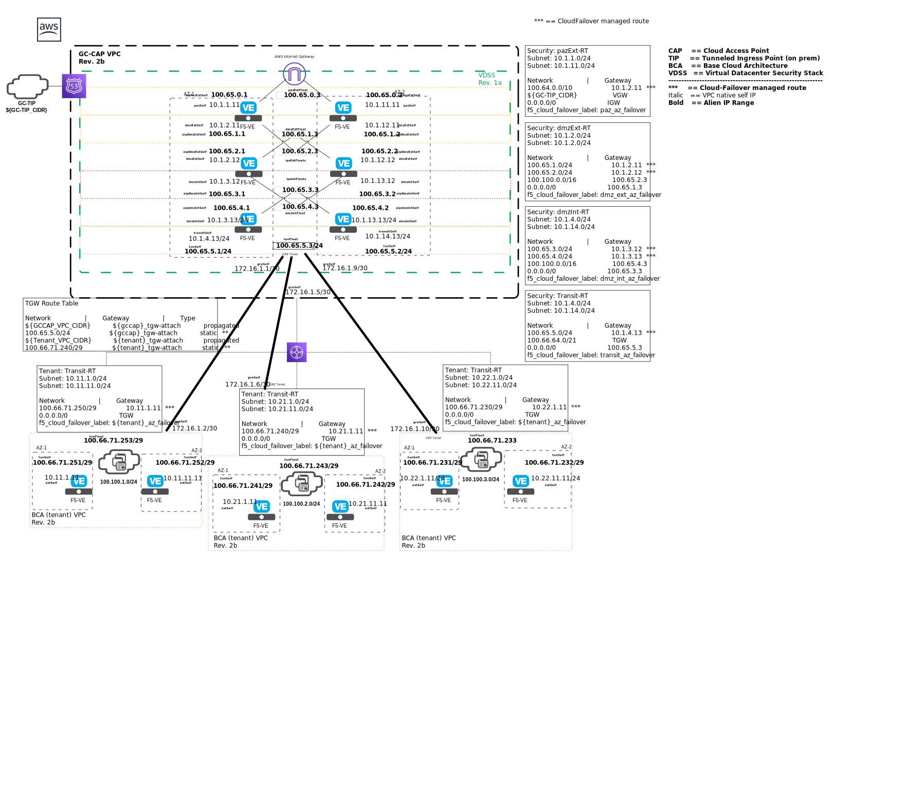

## Introduction

This repo contains a set of Terraform modules and templates to deploy a Secure Cloud Architecture reference implementation in AWS. 

## Security Controls

The following Government of Canada ITSG security controls can be met through configuration of this template:

- AC-2, AC-2(1), AC-3(7), AC-4, AC-2(5), AC-6, AC-7, AC-8, AC-9, AC-10, AC-11, AC-12, AC-17, 
- AU-2, AU-8, AU-8(1), AU-8(2), AU-9(2), AU-12(2), 
- CM-5, CM-6, CM-7, 
- CP-9, CP-10(5), CP-4(4), CP-9(1),
- IA-2, IA-2(8), IA-5(1), IA-5(2), IA-5(6), 
- SC-5, SC-7, SC-7(11), SC-7(18), SC-8, SC-8(1), SC-10, SC-12, SC-13, SC-24,
- SI-2, SI-4, SI-4(4), SI-4(10), 

Please see this reference for more details: [ITSG.md](ITSG.md)

## Terraform Template Information

- Update terraform.tfvars with local values
- SSH Key defaults to ~/.ssh/id_rsa.pub on this system (controlled via the variable key_path)
- update main.tf in the root folder with valid F5 License Keys (BEST Bundle + IPS + IPI)

## Ideas for future enhancements

- Incorporate automatic SSL certificate service (i.e., let's encrypt?)
- Incorporate Shape Fraud Prevention services (Install the iRule & DG, stage it for use)
- ~Incorporate SRA webtop portal solution deployment for each tenant F5 pair~
- Add outbound internet connectivity through the VDSS stack
- Add automation to complete the initial configuration of all devices
 - TS, DO, AS3, CF, onboarding script
- ~Update f5 BigIP IAM Role to include permissions for S3 or Cloudwatch - whichever consumer TS is configured to send to.~
- ~Add VPC Endpoints to each VPC: S3, Cloudwatch (logs), EC2~
- ~Add CF tags (CF failover label & f5_self_ips) to managed route tables and EIPs~
- ~Add CF tags (cf_failover_label) to tmm NICs (eth1, eth2)~
- ~Upgrade to use CF-1.0.0 RPM (vars.tf URL)~
- ~Upgrade to use Latest AnO RPMs (vars.tf URL)~
- ~Implement a proper prefix based object naming convention~
- ~Implement resource group tags~
- ~Develop visualization of TS data stored in Cloudwatch~
- ~Implement Tenant VPC terraform module~
- ~Clean up GC-CAP VPC creation scripts (terraform)~

### Dan's additions to the above to do list:
- Refactor the tenant tf code (to fix the secondary IP assignment bug, fix Cluster DO, CF, etc…)
- Add "module" call in main.tf to tenant module? Or maybe more efficient/elegant to use a .sh script?
- Test to confirm that failover behaves as expected (CF extention)
- Add logic to detected failed creation of instances (i.e., bigip2 onboard.sh script failed to install/run, or bootup took too long and terraform aborted and did not assign the mgmt eip to eth0 and left the bigip instance unreachable, or license activation failed…)
- Create TS AS3 template for bigip instances that don't have ASM provisioned (as is the case for transitbigip)
- The http profile generated by the AS3 declaration for SRA doesn't allow WebSSH to work… to fix the problem, I need to patch the virtual server with the generic HTTP profile (not the customized one generated by AS3).
- should be relatively easy to refactor the tenant vpc/bigip code to match how it is in the MAZ module?
- Need to make different TS AS3 json template files, some need to log ASM events, others only LTM and APM, etc...
- Transit bigip2 is always coming up as Active instead of Standby. Need to troubleshoot to understand why and fix.

## Dan's updates (new branch called "dancayercse" in Steve's repo)
- updated the code to install the newer version of the RPM for TS, to allow for use of IAM role instead of having to pass AWS API creds.
- adjusted the "depends_on" values for resources to avoid clashing (i.e., can't assign secondary IP's if the VE instance is not done deploying/building)
- Add a new "revoke_eval_keys_upon_destroy*" resource in each "bigip*.tf" file to help reduce our burn rate of eval keys.
- Refactored the bigip*.tf modules in the root folder and also the one in the MAZ modules folder. DO, CF, TS and "revoke keys upon destroy" all appear to be working now.
- The MAZ code is now a module in the modules folder and is "called" from the parent "main.tf" file in the root folder.
- I tested a new strategy for declaring the variables for the MAR BIGIP's, using a variable type = map(object)... see the tenant_vars.auto.tfvars file.
- To have the SRA WebSSH AS3 package deployed as part of/from the main terraform file, I added a sleep funciton to ensure the declaration is sent only after the DO and CF declarations have completed successfully.
- Upon initial apply, the http profile generated by the AS3 declaration for SRA doesn't allow WebSSH to work (connection resets when trying to access the WebSSH portal resource)… I discovered that changing the http profile to the generic "http" profile in the virtual server via the GUI resolves the problem and also, putting the profile created by the AS3 declaration (/SRA/SRA_Webtop/webtop_http) profile back on the virtual server also works, but only if done via the GUI. I tried using tmsh commands to manually change the profile to http and then back to webtop_http via SSH CLI, but it didn't work (still getting connection reset when accessing the WebSSH portal resource).
- Applied in the ./init folder to create S3 and DynamoDB resources to store the tf state file.
- un-commented the "terraform backend S3" code at the top of ./main.tf (to facilitate collaboration between Steve & Dan?).

## Requirements

- Linux Bash Shell enviorment (Windows not supported at this time)
- Linux Terraform binary v0.12 
- AWS Subscription IAM Access ID, Access Key (API creds)
- SSH private and public keys (for CLI authentication)
- 4x F5 HP-VE BEST Bundle License Keys with IPI, IPS options
- 2x F5 1Gbps VE BEST Bundle License Keys with IPI, IPS options
- 4x F5 200Mbps VE BEST Bundle License Keys

---

### Copyright

Copyright 

### License

#### Contributor License Agreement

