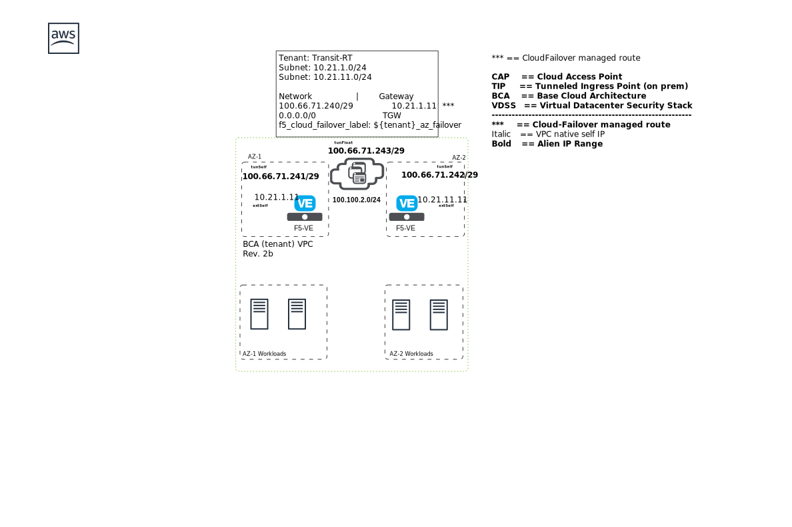

## Introduction

This Terraform module will deploy the Tenant Workload Zone components (aka BCA) of F5's Secure Cloud Architecture reference implementation in AWS. 

## TODO List
 - update new onboarding script template
   - no need to disable DHCP (DO Bug fixed) and statically configure mgmt interface and mgmt routes
   - add /LOCAL_ONLY folder stuff needed for multi-az
 - Migrate to new onboarding script
 - remove remote provisioners for REST API
 - migrate F5 REST API renders to f5_api_data.tf
   - move all templates to templates sub-folder
   - move all rendered output files to files sub-folder
 - migrate F5 REST API output files to f5_api_debug.tf
 - move eips to eip.tf
 - move nics to nic.tf